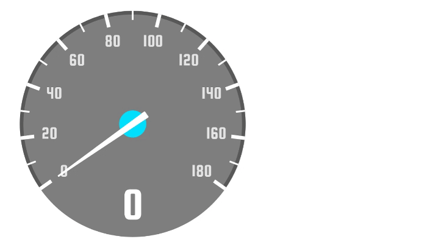
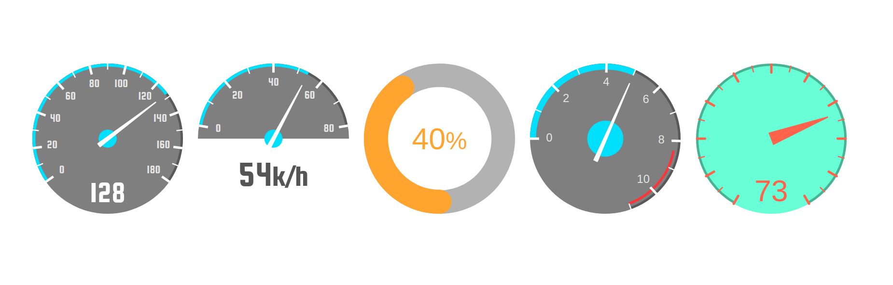
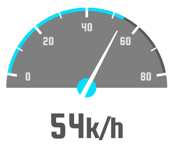
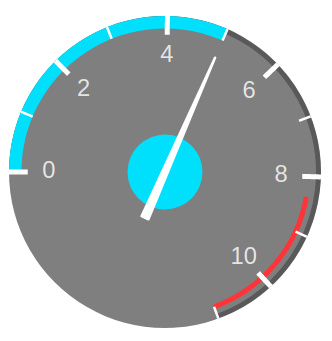
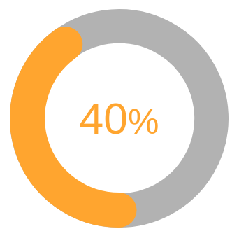
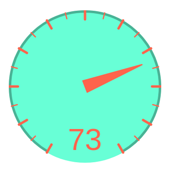

# Cool Speedometer 😎
If you are tired of all those boring speedometers for react native, have a look at this one. This is different. This is cool.





✅ Flexible

✅ Made out of SVG

✅ Animated

✅ More customization than you'll use

✅ Cool 😎


Install it for free:
```bash
npm i react-native-cool-speedometer
```

## Usage

```js
<Speedometer
  value={128}
  fontFamily='squada-one'
/>
```
Note you'll need to configure the font by your own.

### Playing with angle

```js
<Speedometer
  value={54}
  max={80}
  angle={160}
  backgroundAngle={180}
  indicatorStyle={{
    bottom: 25,
    fontSize: 60,
    color: '#555'
  }}
  fontFamily='squada-one'
  indicatorSuffix='k/h'
/>
```

### Rotated
Changing `rotation`, `step`, the looking of the needle, and adding an optional "danger zone":

```js
<Speedometer
  primaryArcWidth={10}
  secondaryArcWidth={4}
  value={5}
  step={1}
  max={11}
  noIndicator
  rotation={-90}
  dangerZone
  needle={{
    baseOffset: 40,
    circleRadius: 30
  }}
/>
```

### Circular progress

```js
<Speedometer
  primaryArcWidth={40}
  value={40}
  max={100}
  lineCap="round"
  noNeedle
  noLineMarks
  noNumberMarks
  angle={360}
  accentColor="orange"
  noBackground
  duration={500}
  indicatorCentered
  indicatorStyle={{
    color: 'orange'
  }}
  indicatorSuffix='%'
/>
```

### More options
Make it as ugly as you want:


```js
<Speedometer
  value={73}
  max={100}
  step={5}
  angle={300}
  backgroundColor='aquamarine'
  backgroundOpacity={1}
  noProgress
  noNumberMarks
  needle={{
    color: 'tomato',
    circleColor: 'transparent',
    baseWidth: 20,
    baseOffset: 0
  }}
  marks={{
    lineCap: 'round',
    lineColor: 'tomato'
  }}
  indicatorStyle={{
    color: 'tomato'
  }}
/>

```

## Properties
| Prop | Default | Type | Description
| :---- | :------ | :--- | :---------
| size | 250 | number | Size of the speedometer. Note that if you change this value you will probably need to adjust the font size of the indicator and the marks. |
| primaryArcWidth | 5 | number | Width of the progress bar |
| secondaryArcWidth | primaryArcWidth - 1 | number | Width of the secondary arc. Will use the progress bar width as reference by default. |
| accentColor | '#00e0ff' | string | Accent color. Used by default for the progress bar, and the circle of the needle. |
| primaryArcColor | accentColor | string | Color of the primary path. |
| secondaryArcColor | 'black' | string | Color of the secondary path. |
| secondaryArcOpacity | 0.3 | number | Opacity of the secondary path. |
| style | | object | Style applied to the speedometer |
| rotation | | number | By default, the rotation is computed with the given `angle`. If you want to change the rotation (like [this example](#rotated)) have in mind that "0" is at the top of the circle. |
| lineCap | 'butt' | string | Line terminations, can be `butt`, `line`, or `square`. |
| angle | 250 | number | Angle of the speedometer in degrees |
| value | 0 | number | Actual speed |
| max | 180 | number | Max velocity |
| noIndicator | | boolean | Whether to hide the indicator |
| backgroundColor | '#000000' | string | Color of the background |
| backgroundOpacity | 0.5 | number | Opacity of the background |
| step | 10 | number | Times the max speed will be divided in to show the marks |
| indicatorStyle | {} | object | Style applied to the indicator | 
| noNeedle | | boolean | Whether to hide the needle |
| indicatorCentered | | boolean | Whether to vertically align the indicator | 
| noLineMarks | | boolean | Whether to hide the line marks |
| dangerZone | | boolean | Whether to show the red line at the right |
| dangerZoneAngle | 60 | number | Angle to show the danger zone (from the right) |
| noProgress | | boolean | Whether to hide the progress bar |
| needle | {} | object | [Needle options](#needle-options) |
| marks | {} | object | [Marks options](#marks-options) |
| noNumberMarks | | boolean | Whether to hide the numbers next to the line marks |
| noBackground | | boolean | Whether to hide the background circle |
| backgroundAngle | 360 | number | Angle of the circle path used for the background. It is usually better to let this by default. |
| fontFamily | 'helvetica' | string | Font to use in the indicator and the marks. You need to configure in your project the font you want to use. |
| indicatorSuffix | | string | Text to append to the indicator, for example 'k/h' or '%'. |
| indicatorSuffixStyle | {} | object | Style applied to the suffix of the indicator. (You can reduce its font size to make it more cool). |
| calcSizeByAngle | false | boolean | Calculate the component view by angle, usable when in case when component is square and the height calculated by backgroundAngle |
| calcSizeByAngleIndicatorHeight | number | 0 | When calcSizeByAngle is used with bottom indicator, the indicator height must be added to total height | 

### Needle Options
| Prop | Default | Type | Description |
| :---- | ------: | :--- | :----- |
| baseWidth | 6 | number | Width of the base of the needle |
| baseOffset | 18 | number | Distance from the center of the circle |
| color | 'white' | string | Color of ne needle |
| circleRadius | 15 | number | Radius of the circle behind the needle |
| circleColor | accentColor | string | Color fo the circle behind the needle |

### Marks Options
| Prop | Default | Type | Description |
| :---- | ------: | :--- | :----- |
| lineCap| 'butt' | string | Line terminations, can be `butt`, `line`, or `square`. |
| lineColor| 'white' | string | Color of the lines |
| lineOpacity| 1 | number | Opacity of the lines |
| numbersRadius| 17 | string | Change this to place the numbers closer or farther of the center. |
| numbersFontSize| 19 | string | Font size of the number marks |
| roundNumbers | false | boolean | Round the numbers in case of decimal value. |